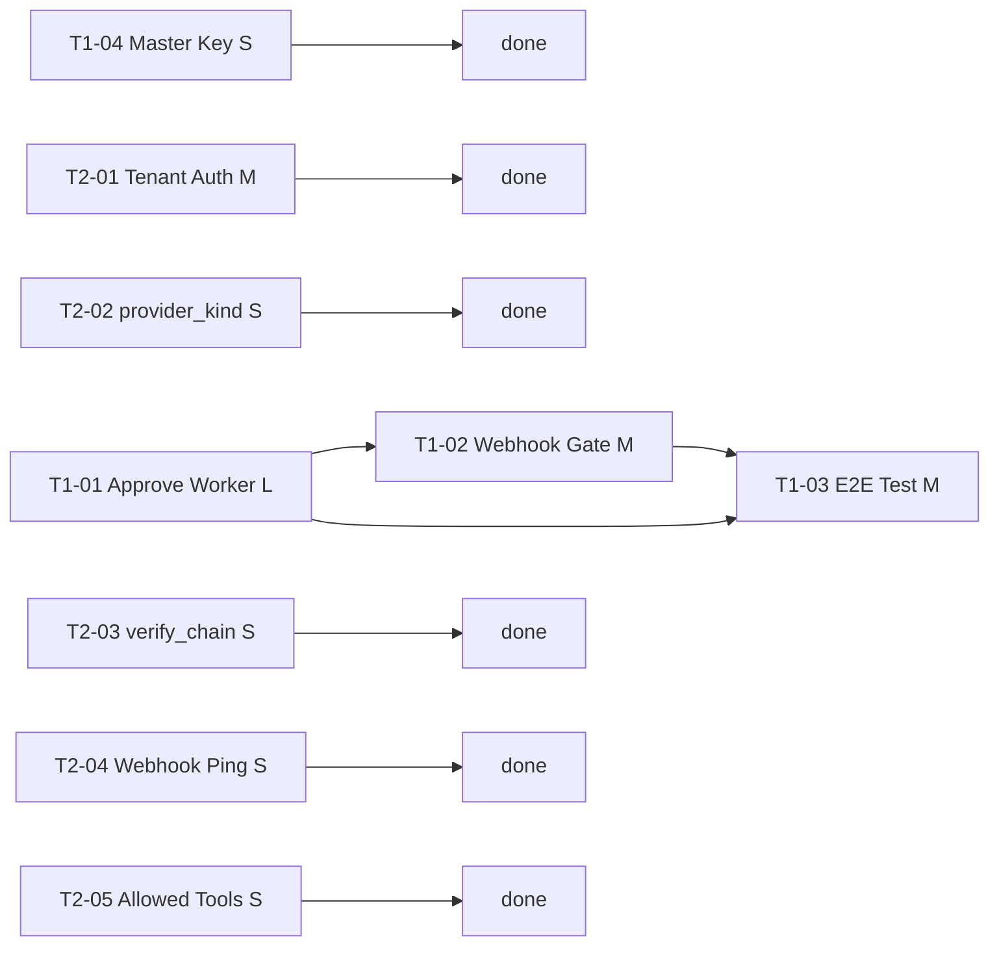

# Nova v1 Readiness — Work Items Index

Generated 2026-05-03. Source of truth: `docs/audits/2026-05-03-readiness-assessment.md`.

All Tier 1 and Tier 2 roadmap items from the assessment are represented here as
one file per task. Tasks are sized S/M/L (S < 4hr, M < 1 day, L > 1 day).

---

## Task Registry

| ID | Title | Tier | Size | Blocks | Blocked By | Done = |
|----|-------|------|------|--------|------------|--------|
| T1-01 | Approve → Execute Worker | 1 | L | T1-02, T1-03 | — | `test_approve_triggers_tool_execution` passes; tool_call audit row appears within 5s of approve |
| T1-02 | register_webhook Through Consent Gate | 1 | M | T1-03 | T1-01 | `test_register_webhook_surfaces_approval_card` passes; 202 returned; auto-rule created |
| T1-03 | CI Triage E2E Automated Test | 1 | M | — | T1-01, T1-02 | `test_full_ci_triage_loop_opens_pr` passes with `REQUIRES_GITHUB=1` |
| T1-04 | CREDENTIAL_MASTER_KEY Auto-Bootstrap | 1 | S | — | — | Orchestrator starts without `CREDENTIAL_MASTER_KEY` in env; `POST /credentials` returns 201 |
| T2-01 | Resolve tenant_id from Auth Context | 2 | M | — | — | `test_user_a_cannot_read_user_b_credentials` passes |
| T2-02 | provider_kind on approval_requests | 2 | S | — | — | `test_provider_kind_stored_and_used_in_consent_rule` passes; FIXME removed from consent.py |
| T2-03 | verify_chain in Cortex Maintain Drive | 2 | S | — | — | `test_maintain_drive_detects_tampered_audit_row` passes; ERROR log on broken chain |
| T2-04 | Cortex Daily Webhook Health Ping | 2 | S | — | — | `test_maintain_drive_marks_failed_webhook_and_alerts` passes; failed webhook → status='failed' |
| T2-05 | Fix ci_triage_agent allowed_tools | 2 | S | — | — | `test_ci_triage_task_agent_allowed_tools_are_registered` passes; no phantom tool names |

---

## Dependency Graph

```
T1-04 (S) ─────────────────────────────────► (standalone)

T1-01 (L) ──┐
            ├──► T1-02 (M) ──► T1-03 (M)
            │
            └──► T1-03 (M, also blocked on T1-02)

T2-01 (M) ─────────────────────────────────► (standalone, parallel)
T2-02 (S) ─────────────────────────────────► (standalone, parallel)
T2-03 (S) ─────────────────────────────────► (standalone, parallel)
T2-04 (S) ─────────────────────────────────► (standalone, parallel)
T2-05 (S) ─────────────────────────────────► (standalone, parallel)
```



---

## Dispatch Order

### Immediate starts (no blockers)

**T1-04** (S) — Start this first. It is 4-8 hours of work and unblocks day-1
usability on fresh installs. Independent of everything else.

**T2-05** (S) — Start in parallel with T1-04. One migration, one test. Lowest
risk of all tasks.

**T2-02** (S) — Start in parallel. One migration column, one function change
to remove a FIXME. Targets consent.py which T1-01 also touches — coordinate if
T1-01 is in-flight to avoid a merge conflict on `decide_approval()`.

### After T1-04 lands

**T1-01** (L) — The highest-priority task overall. Blocks two other Tier 1 items.
Should be the first large task started. Touches `consent.py`, `executor.py`, a new
`approval_worker.py`, and `main.py`. The seam test (`test_approve_triggers_tool_execution`)
is the single most important test in the codebase — write it first, watch it go red.

### After T1-01 lands

**T1-02** (M) — Immediately after T1-01. The consent gate for webhook registration
requires the approve→execute worker to be present or the approval card is a dead end.

**T2-01** (M) — Can run in parallel with T1-02. Auth context dependency in
capabilities router. Does not depend on T1-01's approve worker — it is a routing
layer change. However, if T1-01 touches `consent.py:decide_approval()` and T2-02
also touches it, coordinate to avoid conflicts.

### After T1-02 lands

**T1-03** (M) — The E2E test. Requires both T1-01 (approve executes) and T1-02
(webhook goes through consent gate) to be solid. This is the final gating task for
v1's "shipped" claim.

### Parallel at any time (no code conflicts with T1 tasks)

**T2-03** (S) and **T2-04** (S) — Both add code to `cortex/app/drives/maintain.py`
in additive ways. They do not conflict with each other but if run simultaneously,
coordinate on `assess()` to avoid duplicate edits. Assign to separate agents or
serialize them.

---

## Quality Rules (enforced in every task spec)

1. **TDD always**: every task writes the failing seam test FIRST, watches it go red,
   then implements.
2. **Real services**: no mocks at integration boundaries. The project rule is
   "Tests must use real services, not mocks."
3. **End-to-end proof**: each task names a specific verification command that runs
   through every layer the user touches.
4. **Does NOT change**: every task has a defensive "behaviors not to change" section.
5. **No stubs left behind**: any FIXME or TODO in the modified files must be
   resolved or explicitly deferred to a named future task.

---

## Things Explicitly NOT in Scope for These Tasks

Per `docs/audits/2026-05-03-readiness-assessment.md` "Things to NOT do":

- Do not add more `test_capability_*.py` unit tests until T1-01 is closed.
- Do not refactor `_DEFAULT_TENANT` individually — T2-01 does it wholesale.
- Do not add a second provider (Cloudflare/AWS) before T1-01, T1-02, T2-01 are done.
- Do not remove the polling worker.
- Do not extract capability-broker to a microservice.
- Do not add chat-bridge auto-approve.

---

## Migration Number Coordination

The last committed migration is `076_review_policy_auto.sql`. Tasks that require
new migrations must use sequential numbers:

| Migration | Task | Description |
|-----------|------|-------------|
| 077 | T1-01 or T1-04 | Whichever lands first (tool_context column or credential_master_key config row) |
| 078 | Next in sequence | Assigned at merge time |
| 079 | Next in sequence | ... |

If two tasks are in-flight simultaneously and both need a migration, the second
to merge takes the next number. Migration files must be numbered at merge time,
not at task-start time. Each sub-agent should leave a placeholder (e.g. `0XX_PLACEHOLDER`)
if they can't confirm the number — the integrating human assigns the number before
merging.
